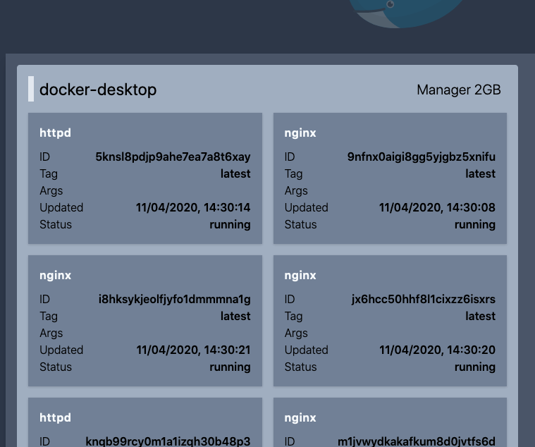

# Docker Swarm Visualiser

This is a simple web page that will show you live updates of the containers running in your local swarm.  It was written while a bit bored during the lockdown and is just a re-write of the original
[docker swarm visualizer](https://github.com/dockersamples/docker-swarm-visualizer) using [alpinejs](https://github.com/alpinejs/alpine) and [tailwindcss](https://tailwindcss.com/).



Proper docs to follow...

## Quick Usage

### Locally

```bash
npm install
node index.js
```

### Docker
```bash
docker build -t vis:0.1 .
docker run -v /var/run/docker.sock:/var/run/docker.sock -p 3000:3000 vis:0.1
```

In either case you should be able to visit http://localhost:3000 in your browser and see the page.

There is also a little bash script you can run by doing `./demo.sh` which will create two services
and scale them randomly between 1-10 containers.

